PAV - P5: síntesis musical polifónica
=====================================

Obtenga su copia del repositorio de la práctica accediendo a [Práctica 5](https://github.com/albino-pav/P5) 
y pulsando sobre el botón `Fork` situado en la esquina superior derecha. A continuación, siga las
instrucciones de la [Práctica 2](https://github.com/albino-pav/P2) para crear una rama con el apellido de
los integrantes del grupo de prácticas, dar de alta al resto de integrantes como colaboradores del proyecto
y crear la copias locales del repositorio.

Como entrega deberá realizar un *pull request* con el contenido de su copia del repositorio. Recuerde que
los ficheros entregados deberán estar en condiciones de ser ejecutados con sólo ejecutar:

~~~~~~~~~~~~~~~~~~~~~~~~~~~~~~~~~~~~~~~~~~~~~~~~~~~~~.sh
  make release
~~~~~~~~~~~~~~~~~~~~~~~~~~~~~~~~~~~~~~~~~~~~~~~~~~~~~

A modo de memoria de la práctica, complete, en este mismo documento y usando el formato *markdown*, los
ejercicios indicados.

Ejercicios.
-----------

### Envolvente ADSR.

Tomando como modelo un instrumento sencillo (puede usar el InstrumentDumb), genere cuatro instrumentos que
permitan visualizar el funcionamiento de la curva ADSR.

* Un instrumento con una envolvente ADSR genérica, para el que se aprecie con claridad cada uno de sus
  parámetros: ataque (A), caída (D), mantenimiento (S) y liberación (R).

  ***Amb els quatre trams ben diferenciats s'aprecia clarament l'atac, la caiguda fins al nivell de manteniment, el manteniment i la lliberació en deixar la nota.***

  ***CORBA TEÒRICA***
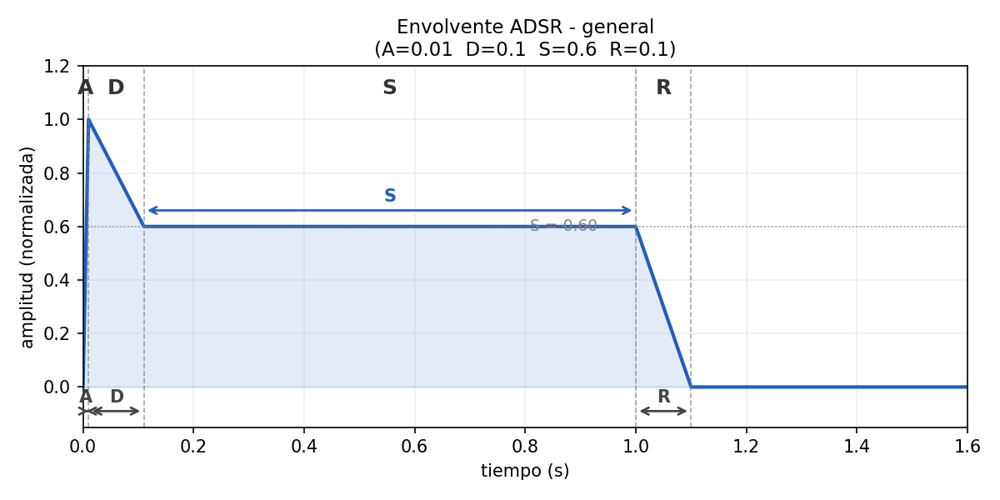

  ***CAPTURA WAVESURFER***
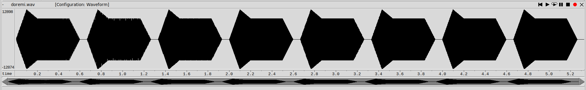


* Un instrumento *percusivo*, como una guitarra o un piano, en el que el sonido tenga un ataque rápido, no
  haya mantenimiemto y el sonido se apague lentamente.
  - Para un instrumento de este tipo, tenemos dos situaciones posibles:
    * El intérprete mantiene la nota *pulsada* hasta su completa extinción.
    * El intérprete da por finalizada la nota antes de su completa extinción, iniciándose una disminución
      abrupta del sonido hasta su finalización.
  - Debera representar en esta memoria **ambos** posibles finales de la nota.

  ***Guitarra: el so s'extingeix sol (la caiguda arriba a zero) abans que es deixi anar la nota; el NoteOff arriba quan ja no hi ha senyal.***

  ***CORBA TEÒRICA - GUITARRA:***

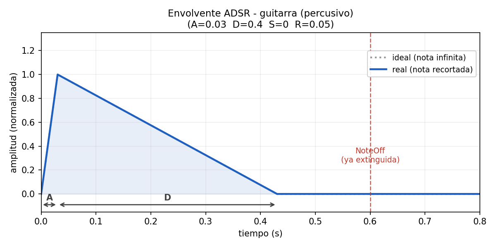

  ***CAPTURA WAVESURFER - GUITARRA:***

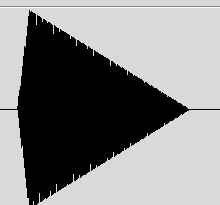

  ***Piano: la nota s'acaba (NoteOff) abans que el so s'hagi extingit; en deixar la tecla, el release retalla el so que encara sonava.***

  ***CORBA TEÒRICA - PIANO:***
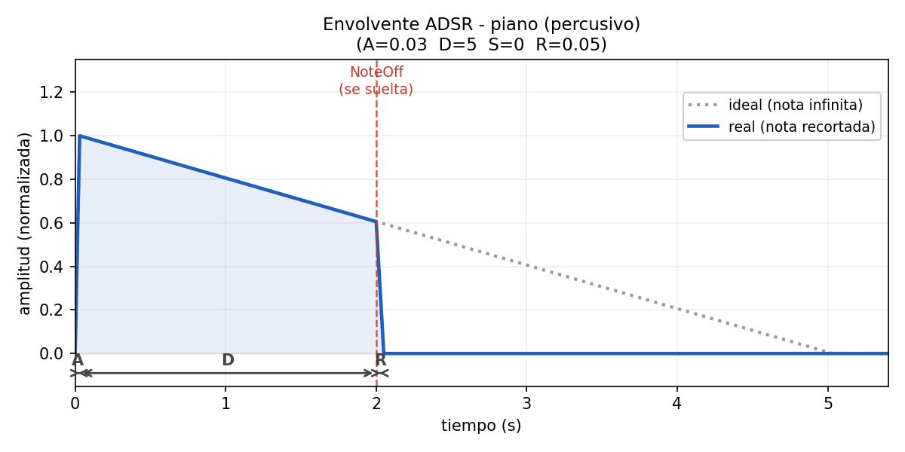

  ***CAPTURA WAVESURFER - PIANO:***
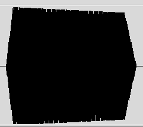

  ***La línia sòlida és l'envolvent real (amb el seu tall) i la puntejada la continuació ideal si la nota fos infinita.***


* Un instrumento *plano*, como los de cuerdas frotadas (violines y semejantes) o algunos de viento. En
  ellos, el ataque es relativamente rápido hasta alcanzar el nivel de mantenimiento (sin sobrecarga), y la
  liberación también es bastante rápida.

  ***Atac ràpid fins al nivell de manteniment, sustain alt i mantingut (S=0.8) i lliberació ràpida (A=0.05, D=0.05, R=0.05).***

  ***CORBA TEÒRICA - CORDA FREGADA***
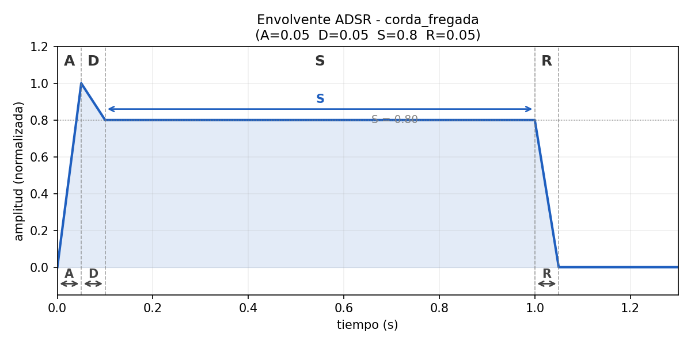

  ***CAPTURA WAVESURFER - CORDA FREGADA***
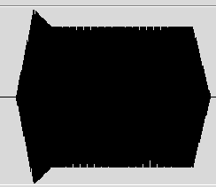

Para los cuatro casos, deberá incluir una gráfica en la que se visualice claramente la curva ADSR. Deberá
añadir la información necesaria para su correcta interpretación, aunque esa información puede reducirse a
colocar etiquetas y títulos adecuados en la propia gráfica (se valorará positivamente esta alternativa).

  ***DADES ADSR DELS 4 MODELS:***
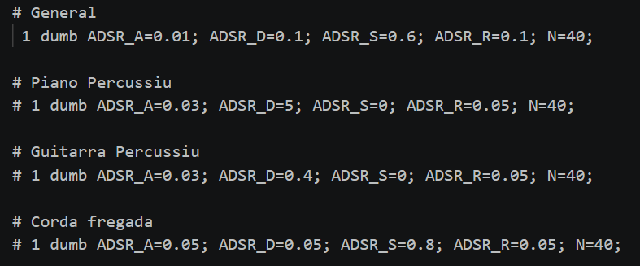


### Instrumentos Dumb y Seno.

Implemente el instrumento `Seno` tomando como modelo el `InstrumentDumb`. La señal **deberá** formarse
mediante búsqueda de los valores en una tabla.

- Incluya, a continuación, el código del fichero `seno.cpp` con los métodos de la clase Seno.

```cpp
#include <iostream>
#include <math.h>
#include "seno.h"
#include "keyvalue.h"

#include <stdlib.h>

using namespace upc;
using namespace std;

Seno::Seno(const std::string &param)
  : adsr(SamplingRate, param) {
  bActive = false;
  x.resize(BSIZE);

 
  KeyValue kv(param);
  int N;

  if (!kv.to_int("N", N))
    N = 40; 

  tbl.resize(N);
  float phase = 0, step_tbl = 2 * M_PI / (float) N;
  fase = 0;
  for (int i = 0; i < N; ++i) {
    tbl[i] = sin(phase);
    phase += step_tbl;
  }
}


void Seno::command(long cmd, long note, long vel) {
  if (cmd == 9) {      
    bActive = true;
    adsr.start();
    fase = 0;
    A = vel / 127.;
    step = 440 * pow(2, (note - 69) / 12.) * tbl.size() / SamplingRate;
  }
  else if (cmd == 8) {  
    adsr.stop();
  }
  else if (cmd == 0) {  
    adsr.end();
  }
}


const vector<float> & Seno::synthesize() {
  if (not adsr.active()) {
    x.assign(x.size(), 0);
    bActive = false;
    return x;
  }
  else if (not bActive)
    return x;

  for (unsigned int i = 0; i < x.size(); ++i) {
    int idx = (int)(fase + 0.5);
    if (idx >= (int)tbl.size()) idx -= tbl.size();   
    x[i] = A * tbl[idx];

    fase += step;
    while (fase >= tbl.size())
      fase -= tbl.size();   
  }
  adsr(x); 

  return x;
}
```


- Explique qué método se ha seguido para asignar un valor a la señal a partir de los contenidos en la tabla,
  e incluya una gráfica en la que se vean claramente (use pelotitas en lugar de líneas) los valores de la
  tabla y los de la señal generada.


  ***MÈTODE D'ASSIGNACIÓ DE VALORS:***

  ***La taula `tbl` emmagatzema un període de sinusoide en N posicions enteres. Per sintetitzar una nota de freqüència***
  ***fonamental f0, la taula es recorre amb un pas `step = f0·N/fs`, on `f0 = 440·2^((note−69)/12)`. Com que `step` no és***
  ***enter en general, l'índex de lectura `fase` cau entre dues posicions de la taula; el valor de la senyal s'assigna***
  ***arrodonint a l'índex enter més proper (`tbl[(int)(fase+0.5)]`) pel mètode del veí més proper.***
  ***La continuïtat de fase ntre blocs es manté arrossegant el valor de `fase` d'una crida a la següent i envoltant-lo mòdul N.***
  ***Aquest mètode introdueix una distorsió de quantització (visible a les gràfiques com la desviació dels punts respecte a la sinusoide ideal), que es podria reduir amb interpolació lineal entre les dues mostres adjacents.***

  ***GRÀFICA N=40 (La central, 440 Hz):***
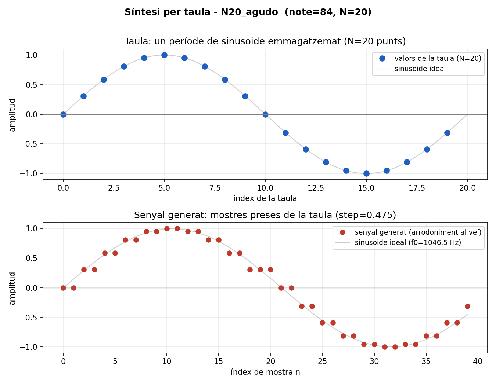
  ***A la part superior es mostren els 40 valors emmagatzemats a la taula, que corresponen a un període complet d'una sinusoide mostrejada uniformement. A la part inferior es mostra el senyal generat per l'instrument en sintetitzar la nota La₄ (440 Hz). Com que el pas de lectura és step = 0,399, l'índex avança menys d'una posició per cada mostra de sortida, de manera que diverses mostres consecutives s'arrodoneixen al mateix punt de la taula i apareixen valors repetits (es veuen com petits esglaons). Els punts vermells representen el senyal real arrodonit al veí més proper, i la línia grisa és la sinusoide ideal de 440 Hz; la desviació entre tots dos il·lustra la distorsió de quantització introduïda pel mètode.***

  ***GRÀFICA N=20 (nota aguda, ~1046 Hz):***
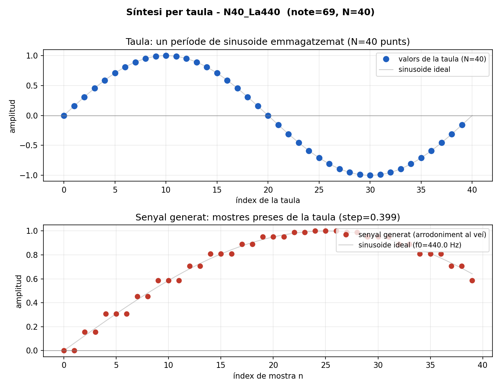
***Amb una taula més curta (N=20) i una nota més aguda, el pas de lectura és més gran (step = 0,475), de manera que l'índex avança gairebé mig punt de taula per mostra. Això permet veure un període complet del senyal generat en menys mostres i apreciar millor com els punts vermells no cauen exactament sobre la sinusoide ideal grisa: en recórrer la taula amb un pas no enter, el valor assignat a cada mostra és el de la posició entera més propera, cosa que separa lleugerament el senyal real de la forma ideal. Aquesta separació és la manifestació visible de l'error introduït pel mètode del veí més proper, que es podria reduir mitjançant interpolació lineal.***


- Si ha implementado la síntesis por tabla almacenada en fichero externo, incluya a continuación el código
  del método `command()`.

  ***Aquesta part no s'ha arribat a implementar. Tot i així, en descrivim el funcionament i mostrem com quedaria el codi.***
  ***La síntesi per taula de fitxer extern (instrument tipus FicTabla) consisteix a generar el so a partir d'un cicle de senyal d'una font real en lloc d'una sinusoide generada internament. La diferència respecte del Seno està només al constructor: en comptes de rebre la mida de la taula (N) i omplir-la amb sin(), rebria el nom d'un fitxer WAVE i en carregaria un cicle amb readwav_mono():***

  ```cpp
    FicTabla::FicTabla(const std::string &param)
      : adsr(SamplingRate, param) {
      bActive = false;
      x.resize(BSIZE);

      KeyValue kv(param);
      string nom_fitxer;
      static string kv_null;

      if ((nom_fitxer = kv("file")) == kv_null) {
        cerr << "Error: no s'ha trobat el camp 'file'" << endl;
        throw -1;
      }

      unsigned int fm;
      if (readwav_mono(nom_fitxer, fm, tbl) < 0) {
        cerr << "Error: no es pot llegir el fitxer " << nom_fitxer << endl;
        throw -1;
      }
      fase = 0;
    }
  ```

  ***El mètode command() seria pràcticament idèntic al del Seno, ja que el càlcul del pas de lectura no depèn de com s'hagi omplert la taula:***
  ```cpp
    void FicTabla::command(long cmd, long note, long vel) {
      if (cmd == 9) {
        bActive = true;
        adsr.start();
        fase = 0;
        A = vel / 127.;
        step = 440 * pow(2, (note - 69) / 12.) * tbl.size() / SamplingRate;
      }
      else if (cmd == 8) {
        adsr.stop();
      }
      else if (cmd == 0) {
        adsr.end();
      }
    }
  ```

  ***Tot i tenir-ne clara la implementació, s'ha prioritzat polir la resta d'instruments i efectes de la pràctica.***


### Efectos sonoros.

- Incluya dos gráficas en las que se vean, claramente, el efecto del trémolo y el vibrato sobre una señal
  sinusoidal. Deberá explicar detalladamente cómo se manifiestan los parámetros del efecto (frecuencia e
  índice de modulación) en la señal generada (se valorará que la explicación esté contenida en las propias
  gráficas, sin necesidad de mucha *literatura*).

  ***EFECTO TRÉMOLO:***
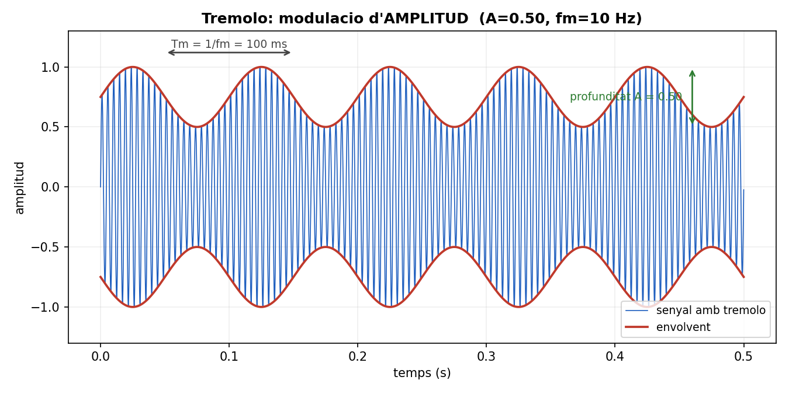
    ***TRÉMOLO - WAVESURFER***
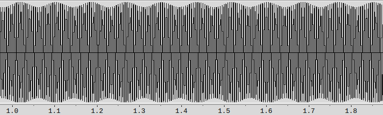
  ***És una modulació d'amplitud. L'envolvent del senyal oscil·la sinusoïdalment a la freqüència de modulació ``fm``,***
  ***amb una profunditat controlada per ``A``. A la gràfica es veu l'envolvent oscil·lant amb període ``Tm=1/fm``i una***
  ***profunditat igual a ``A`` (distància entre el màxim i el mínim de l'amplitud).***

  ***EFECTO VIBRATO:***
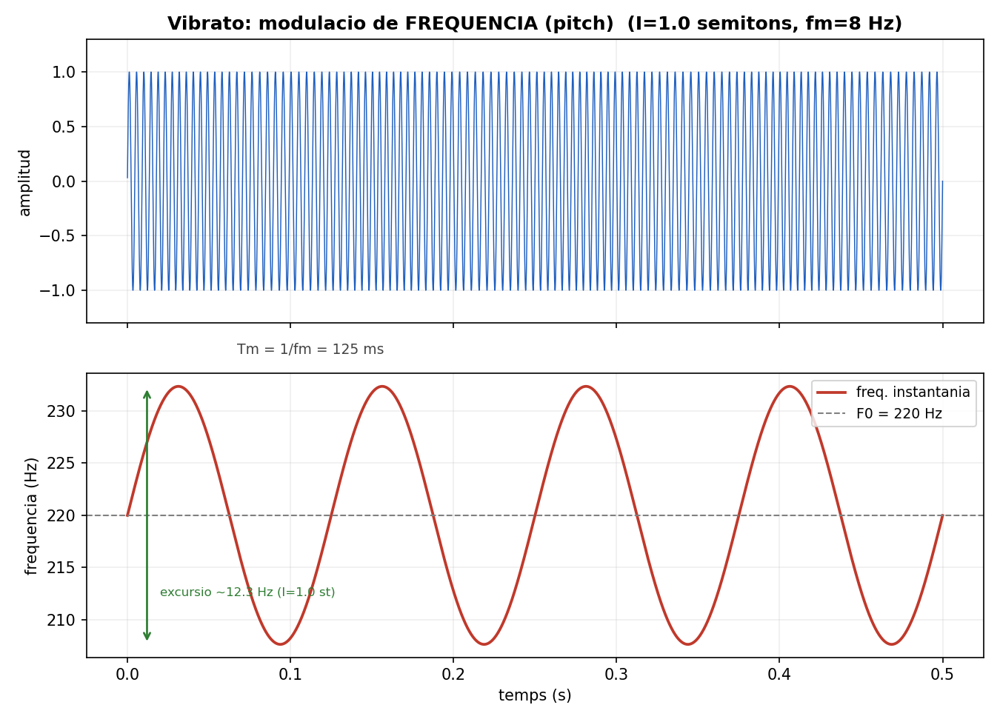
    ***VIBRATO - WAVESURFER***
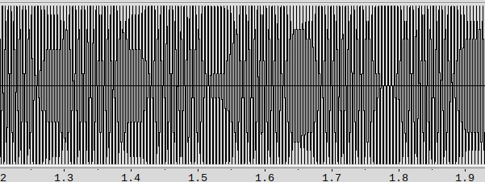
  ***És una modulació de freqüència (pitch). El to oscil·la al voltant de la nota a la freqüència ``fm``, amb una extensió***
  ***de I semitons. A la gràfica, la part inferior mostra la freqüència instantània oscil·lant al voltant de la fonamental,***
  ***amb període ``Tm=1/fm`` i una excursió determinada per ``I``.***


- Si ha generado algún efecto por su cuenta, explique en qué consiste, cómo lo ha implementado y qué
  resultado ha producido. Incluya, en el directorio `work/ejemplos`, los ficheros necesarios para apreciar
  el efecto, e indique, a continuación, la orden necesaria para generar los ficheros de audio usando el
  programa `synth`.

  ***Com a efecte addicional s'ha implementat un glissando (estil trombó) que fa lliscar el to fins a la nota real.***
  ***El senyal d'entrada conté la nota correcta, i l'efecte fa que durant els primers `t` segons el to comenci I semitons***
  ***per sota i pugi de forma contínua fins a la nota real, on es manté. S'ha implementat seguint l'esquema del vibrato***
  ***substituint la moduladora sinusoïdal per una rampa monòtona.***
  ***Com que el factor de pitch sempre és ≤1, l'algorisme és causal de manera natural.***

  ***EFECTO GLISSANDO:***
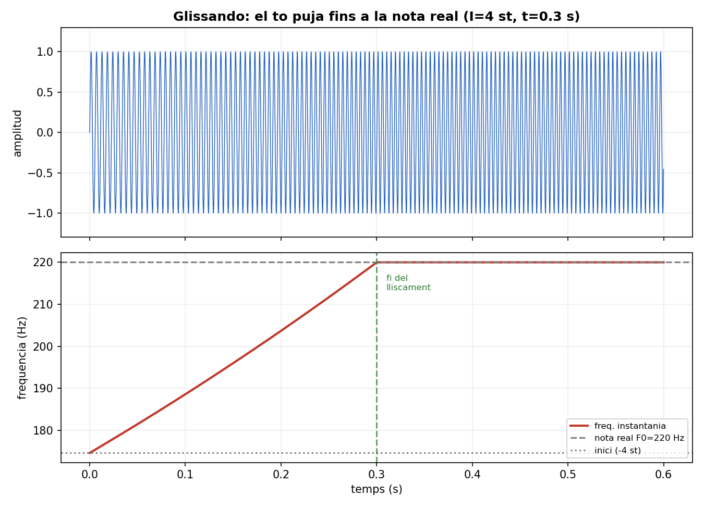
    ***GLISSANDO - WAVESURFER***
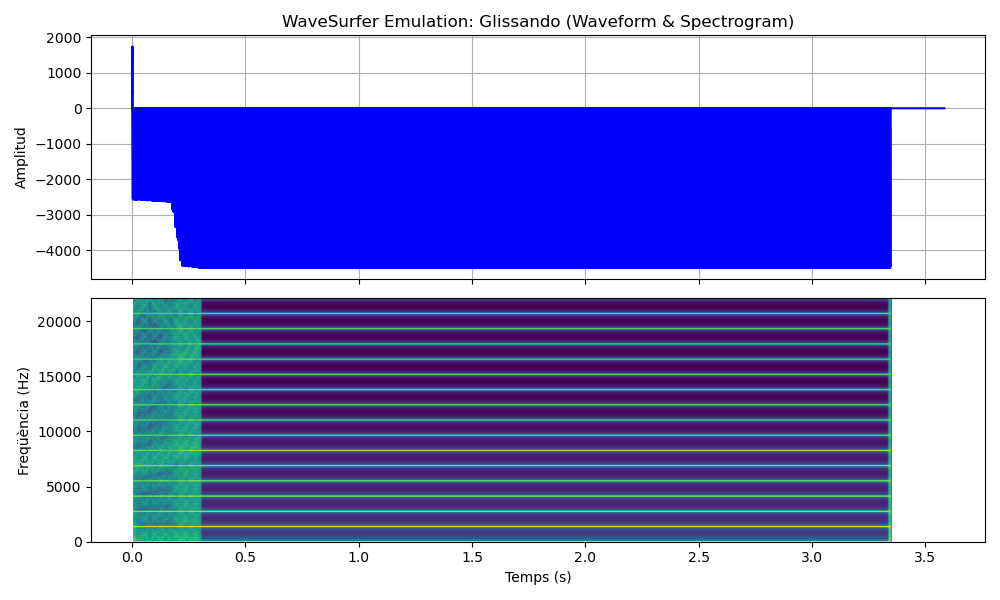

  ***També s'ha generat una gràfica amb l'efecte glissando aplicat a una melodia de quatre notes (53, 57, 60 i 65).***
  ***Cada cop que comença una nota nova, el to entra des de 4 semitons per sota i llisca de forma contínua fins a la***
  ***freqüència objectiu (marcada amb les línies puntejades), on es manté fins a la nota següent. S'aprecia així l'efecte***
  ***de lliscament tipus trombó encadenat al llarg de tota la melodia.***

  ***GLISSANDO MELODIA:***
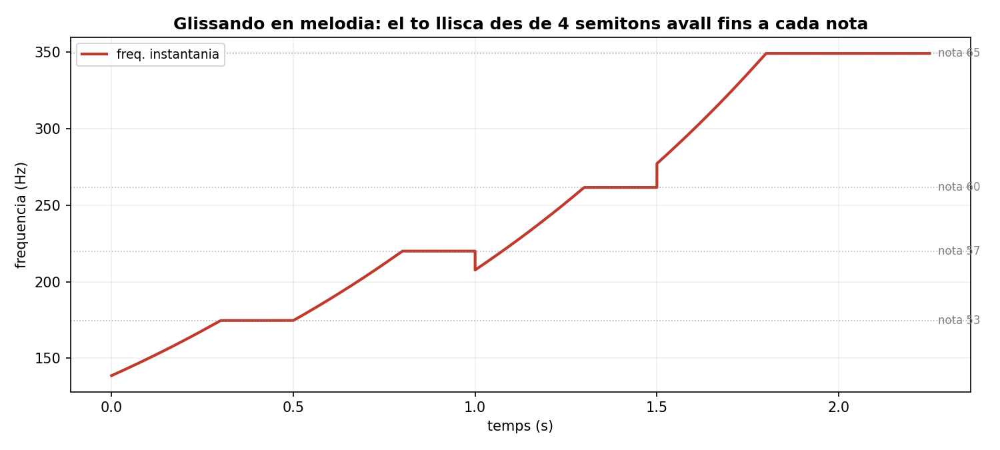
  

  ***ORDRES DE GENERACIÓ DE FITXERS D'ÀUDIO (directori `/work`):***
  ```
    synth -e effects.orc sinus.orc tremolo.sco tremolo.wav
    synth -e effects.orc sinus.orc vibrato.sco vibrato.wav
  ```

  ***ORDRES DE GENERACIÓ DE FITXERS D'ÀUDIO (directori `/work/ejemplos`):***
  ```
    synth -e effects.orc sinus.orc glissando.sco glissando.wav
    synth -e effects.orc sinus.orc glissando_melodia.sco glissando_melodia.wav
  ```


### Síntesis FM.

Construya un instrumento de síntesis FM, según las explicaciones contenidas en el enunciado y el artículo
de [John M. Chowning](https://web.eecs.umich.edu/~fessler/course/100/misc/chowning-73-tso.pdf). El
instrumento usará como parámetros **básicos** los números `N1` y `N2`, y el índice de modulación `I`, que
deberá venir expresado en semitonos.

- Use el instrumento para generar un vibrato de *parámetros razonables* e incluya una gráfica en la que se
  vea, claramente, la correspondencia entre los valores `N1`, `N2` e `I` con la señal que obtuvo.

  ***VIBRATO:***

  ***S'ha construït un instrument de síntesi FM que genera el senyal ``x(t) = A·sin(2π·fc·t + I·sin(2π·fm·t))``, amb ``fc = f0·N1`` i ``fm = f0·N2``.***

  ***Amb freqüència de modulació baixa i índex moderat, l'FM produeix un vibrato.***
  ***A la gràfica, a dalt es mostra el senyal (fc=440 Hz, fm=6 Hz) i a baix la freqüència instantània, que oscil·la al voltant de la portadora amb període ``Tm=1/fm=167 ms`` i excursió de pic ``fd=I·fm=18 Hz``.***
  ***fm fixa la velocitat de l'oscil·lació i el producte I·fm la seva amplitud.***
  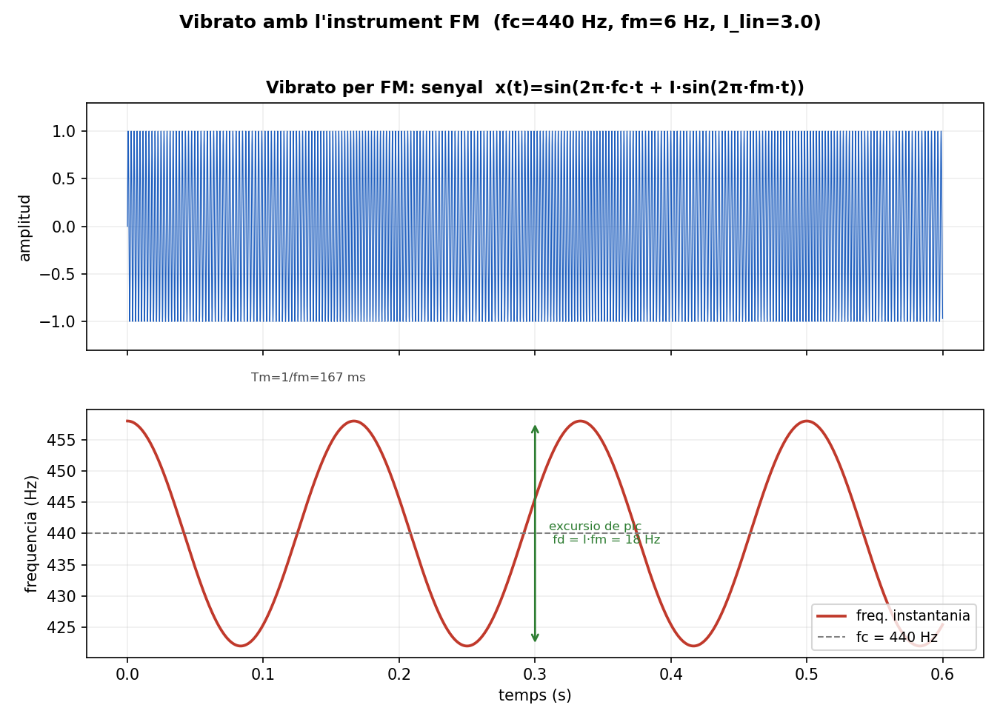


  ***N1 i N2 - RELACIÓ PORTADORA/MODULADORA:*** 
  ***Amb l'índex fix, la relació N1:N2 determina on apareixen les components (``fc±k·fm = f0·(N1±k·N2)``): amb 1:1 surten tots els múltiples de la fonamental, amb 1:2 queden més separades i amb 2:1 la portadora puja cap a l'agut. ***

  ***N1 i N2 controlen el timbre a través de la posició dels harmònics.***
  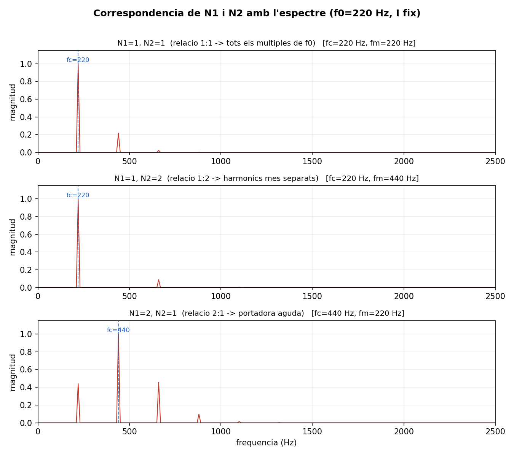


  ***ÍNDEX DE MODULACIÓ I:*** 

  ***A mesura que augmenta l'índex, la forma d'ona es deforma respecte de la sinusoide i apareixen noves components freqüencials.***
  ***L'amplada de banda creix amb l'índex (aproximadament ``2·fm·(1+I)``).***

  ***Forma d'ona:***
  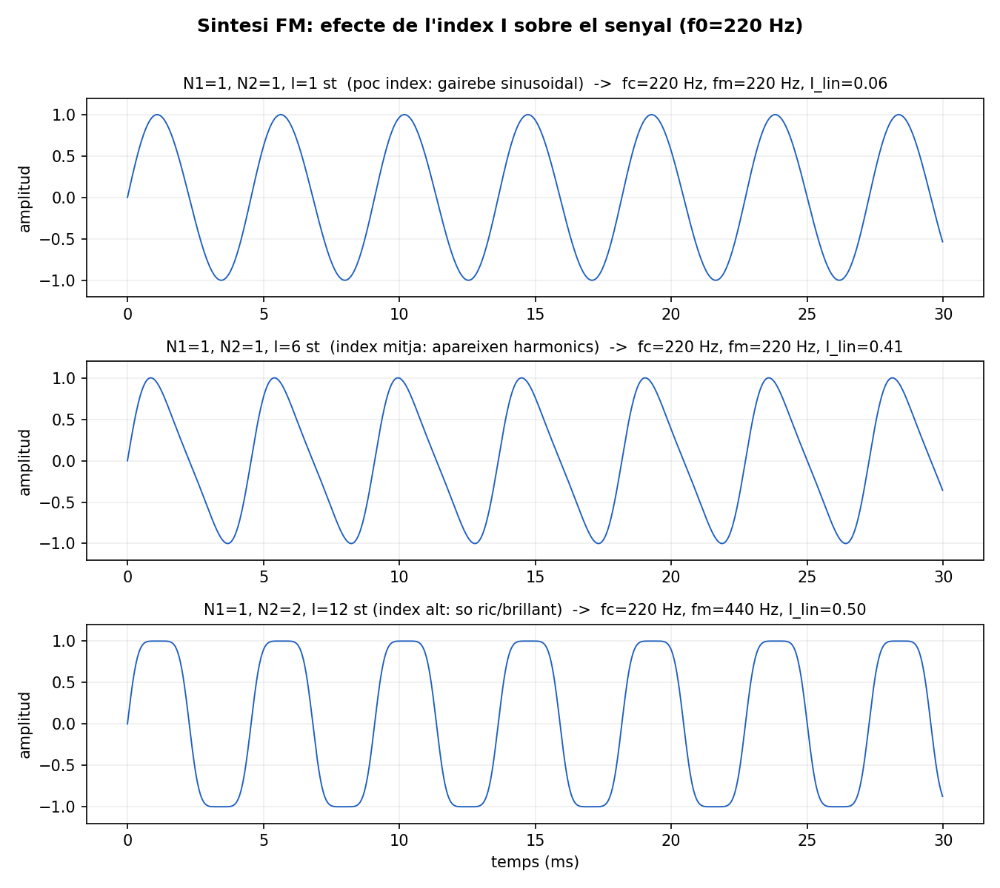

  ***Espectre:***
  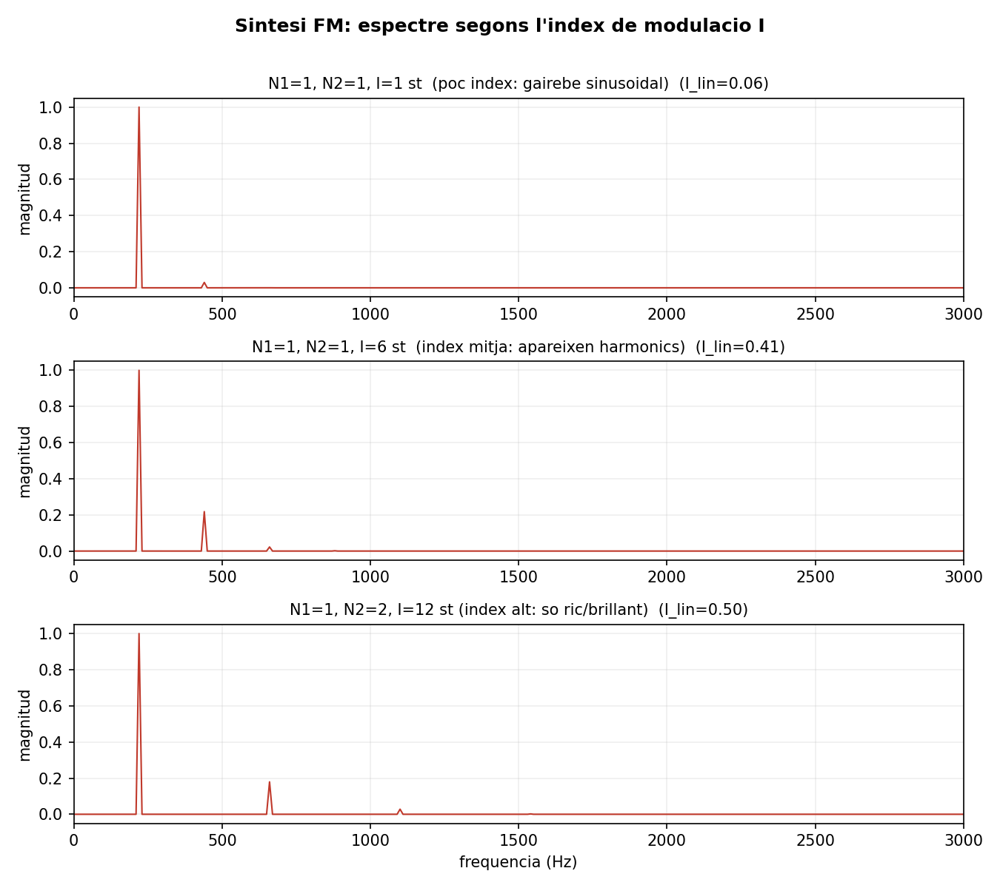


- Use el instrumento para generar un sonido tipo clarinete y otro tipo campana. Tome los parámetros del
  sonido (N1, N2 e I) y de la envolvente ADSR del citado artículo. Con estos sonidos, genere sendas escalas
  diatónicas (fichero `doremi.sco`) y ponga el resultado en los ficheros `work/doremi/clarinete.wav` y
  `work/doremi/campana.work`.

  ***S'han generat dues escales diatòniques:***
  ***El clarinet fa servir relació 3:2 (harmònics senars) amb índex moderat i envolvent sostinguda.***
  ***La campana fa servir relació inharmònica 3:7 i I=10 amb un decaïment llarg tipus percussió i un índex***
  ***que varia en el temps seguint la mateixa envolvent que l'amplitud. D'aquesta forma obtenim l'espectre ric a l'atac***
  ***i es va tornant pur en apagar-se, com en una campana real metàl·lica.***

    ***ORDRES DE GENERACIÓ DELS FITXERS D'ÀUDIO - CLarinet i Campana (directori `/work/doremi`):***
    ```
      synth clarinet.orc doremi.sco clarinete.wav
      synth campana.orc doremi.sco campana.wav
    ```

    ***FORMA D'ONA + ESPECTRES INICI/FINAL:***
    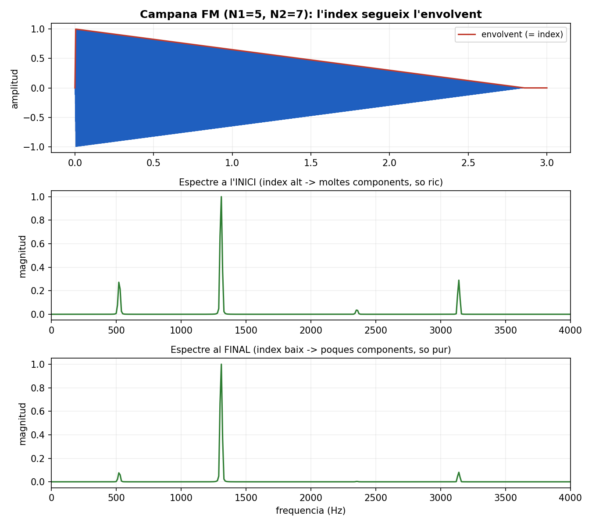

    

  * También puede colgar en el directorio work/doremi otras escalas usando sonidos *interesantes*. Por
    ejemplo, violines, pianos, percusiones, espadas láser de la
    [Guerra de las Galaxia](https://www.starwars.com/), etc.

    ***Aprofitant l'instrument FM i l'efecte de vibrato, s'ha generat un so d'espasa làser. L'FM en registre greu***
    ***amb relació harmònica baixa (N1=1, N2=1) dóna el brunzit amb cos, i el vibrato (extensió petita i freqüència baixa)***
    ***hi afegeix la fluctuació lenta del to.***

    ***ORDRE DE GENERACIÓ DEL FITXER D'ÀUDIO - Làser Star Wars (directori `/work/doremi`):***
    ```
      synth -e laser_effects.orc laser.orc laser.sco laser.wav
    ```


### Orquestación usando el programa synth.

Use el programa `synth` para generar canciones a partir de su partitura MIDI. Como mínimo, deberá incluir la
*orquestación* de la canción *You've got a friend in me* (fichero `ToyStory_A_Friend_in_me.sco`) del genial
[Randy Newman](https://open.spotify.com/artist/3HQyFCFFfJO3KKBlUfZsyW/about).

- En este triste arreglo, la pista 1 corresponde al instrumento solista (puede ser un piano, flauta,
  violín, etc.), y la 2 al bajo (bajo eléctrico, contrabajo, tuba, etc.).
- Coloque el resultado, junto con los ficheros necesarios para generarlo, en el directorio `work/music`.
- Indique, a continuación, la orden necesaria para generar la señal (suponiendo que todos los archivos
  necesarios están en el directorio indicado).
### Orquestació bàsica: *You've got a friend in me* (Toy Story)

Per a l'arranjament del tema principal de *Toy Story* de Randy Newman, s'ha utilitzat el fitxer de partitura proporcionat a la pràctica (`ToyStory_A_Friend_in_me.sco`). S'ha dissenyat una orquestra simple i efectiva per cobrir els dos rols requerits a l'enunciat mitjançant síntesi FM:

- **Pista 1 (Instrument Solista):** S'ha modelat un **Piano** d'estil *jazz*, amb un atac percussiu curt i un índex de modulació alt ($I=3.0$) per donar-li brillantor i fer que la cèlebre melodia destaqui clarament.
- **Pista 2 (Baix):** S'ha optat per un **Contrabaix** acústic. S'ha reduït l'índex de modulació per evitar harmònics estridents i centrar l'energia acústica en les freqüències subgreus, aconseguint un efecte de *walking bass* càlid, rodó i amb molt de cos.

De la mateixa manera que en les orquestracions més complexes, s'ha aplicat un control de volums escalat sobre la partitura base per garantir una mescla neta i evitar qualsevol saturació del senyal. 

Tots els fitxers generats, juntament amb l'orquestra (`toystory.orc`) i la partitura final (`toystory.sco`), es troben al directori `work/music`.

L'ordre necessària per generar la senyal d'àudio final és:

```bash
synth toystory.orc toystory.sco toystory.wav && play toystory.wav
```

También puede orquestar otros temas más complejos, como la banda sonora de *Hawaii5-0* o el villacinco de
John Lennon *Happy Xmas (War Is Over)* (fichero `The_Christmas_Song_Lennon.sco`), o cualquier otra canción
de su agrado o composición. Se valorará la riqueza instrumental, su modelado y el resultado final.
- Coloque los ficheros generados, junto a sus ficheros `score`, `instruments` y `efffects`, en el directorio
  `work/music`.
- Indique, a continuación, la orden necesaria para generar cada una de las señales usando los distintos
  ficheros.

  ### Orquestació avançada: *Penny Lane* (The Beatles)

A més de l'orquestració sol·licitada, s'ha dut a terme un arranjament del tema *Penny Lane* de The Beatles, utilitzant síntesi FM. S'han ajustat acuradament els paràmetres de modulació ($I$, $I_{min}$), la relació de freqüències ($N_1:N_2$) i les envolupants (ADSR) per simular la instrumentació clàssica de la peça original.

L'assignació de les pistes i el seu disseny és el següent:
- **Pista 2 (Veu principal):** Modelada com un Saxo Tenor, amb un atac de canya ric i un cos dinàmic per liderar la melodia.
- **Pista 4 (Baix elèctric):** Simulant el clàssic baix Hofner, amb un to rodó, profund i poca modulació.
- **Pista 5 (Piano rítmic):** So percussiu, amb una caiguda ràpida i un lleuger toc d'estridència metàl·lica.
- **Pista 6 (Contrabaix):** Reforç de freqüències subgreus per donar empenta i cos a la base rítmica.
- **Pistes 7 i 8 (Secció de metalls i Trompeta Piccolo):** Modelatge de vent-metall amb índexs de modulació molt alts a l'atac per aconseguir la màxima brillantor característica de la cançó. La pista 8 actua com a solista, mentre que la 7 executa acords polifònics de fons.
- **Pista 10 (Bateria):** Acompanyament de percussió seca.

*Nota:* S'ha eliminat la Pista 3, ja que el MIDI original contenia exclusivament dades inútils acumulades a l'inici del fitxer. Així mateix, s'ha aplicat un control estricte de volums mitjançant un script per establir una jerarquia sonora i evitar la saturació (*clipping*) deguda a la suma d'harmònics.

Tots els fitxers generats, juntament amb l'orquestra (`pennylane.orc`) i la partitura mesclada (`pennylane.sco`), es troben al directori `work/music`.

L'ordre necessària per generar la senyal d'àudio és:

```bash
synth pennylane.orc pennylane.sco pennylane.wav && play pennylane.wav

> NOTA:
>
> No olvide escuchar el resultado generado y comprobar que no se producen ruidos extraños o distorsiones.
> Sobre todo, tenga en cuenta la salud auditiva de quien será encargado de corregir su trabajo.